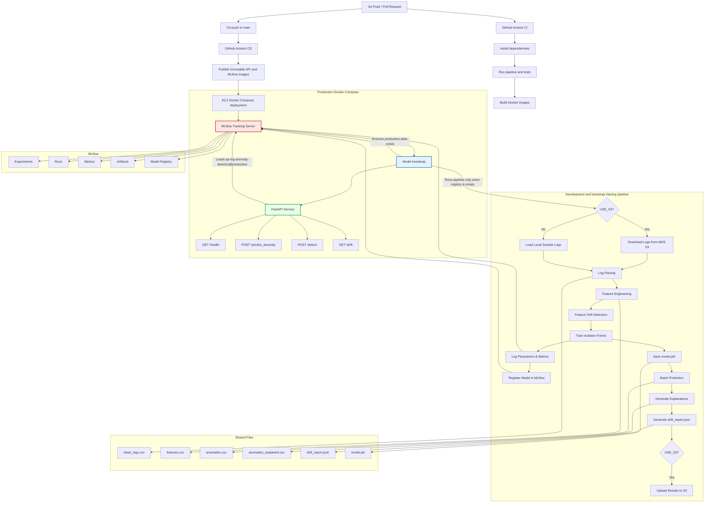

# Log Anomaly Detection Service

An end-to-end MLOps project for real-time and batch anomaly detection on web server logs using Isolation Forest. The project demonstrates a production-inspired machine learning workflow including automated data ingestion, feature engineering, feature drift detection, experiment tracking, model versioning, containerized deployment, and CI/CD.

**Tech Stack:** Python, FastAPI, scikit-learn, MLflow, Docker, GitHub Actions, AWS S3

## Highlights

- End-to-end automated training pipeline orchestrated with Docker Compose
- MLflow experiment tracking and model registry
- Automated feature drift detection using Population Stability Index (PSI) and mean shift analysis
- Batch and real-time anomaly detection with FastAPI
- AWS S3 integration for cloud-based input and generated-output storage
- Dockerized services for training, MLflow tracking, and API serving
- GitHub Actions CI pipeline with automated testing and image builds

## Architecture



## Key Features

- **End-to-End Pipeline:** `run_pipeline.py` orchestrates log parsing, feature engineering, drift detection, model training, prediction, and explainability.
- **Dual Data Mode:** Supports local sample logs for development and CI, or AWS S3 for production-scale data using `USE_S3=true`.
- **Automated Drift Detection:** Detects feature drift using Population Stability Index (PSI) and mean shift analysis, generates a drift report, and exposes results via the API.
- **Experiment Tracking:** Logs parameters, metrics, artifacts, and model versions to an MLflow Tracking Server.
- **Model Registry:** Automatically registers new versions of the `qa-log-anomaly-detector` model in MLflow.
- **Batch & Real-Time Inference:** FastAPI provides `/predict_anomaly` for real-time predictions, `/detect` for batch anomaly results, and `/drift` for drift monitoring.
- **Explainability:** Generates human-readable explanations for detected anomalies using Z-score based feature attribution.
- **Containerized Deployment:** Docker Compose orchestrates the training pipeline, MLflow Tracking Server, and FastAPI service.
- **CI/CD:** GitHub Actions runs CI on pushes to `main` and pull requests, then publishes and deploys images from `main`.


## Project Structure

```text
.
├── .github/
│   └── workflows/
│       └── ci.yml                    # CI pipeline
├── data/
│   ├── raw/
│   │   └── sample_logs.txt           # Sample dataset for local development & CI
│   ├── processed/                    # Generated features, predictions & reports
│   └── reference/                    # Drift detection baseline (auto-generated)
├── docker/
│   ├── Dockerfile.api                # FastAPI service
│   ├── Dockerfile.mlflow             # MLflow Tracking Server
│   └── pipeline.Dockerfile           # Training pipeline
├── src/
│   ├── parser/
│   │   └── log_parser.py
│   ├── features/
│   │   └── feature_builder.py
│   ├── models/
│   │   ├── train.py                  # Isolation Forest + MLflow logging
│   │   ├── predict.py                # Batch inference
│   │   ├── explain_anomalies.py      # Z-score based explainability
│   │   └── isolation_forest.py
│   ├── monitoring/
│   │   └── drift_detection.py        # PSI & mean-shift based drift monitoring
│   ├── service/
│   │   └── app.py                    # FastAPI application
│   └── utils/
│       └── s3_utils.py               # AWS S3 integration
├── tests/                            # Unit tests
├── run_pipeline.py                   # End-to-end training pipeline
├── docker-compose.yml                # Pipeline + MLflow + API services
└── README.md
```

## Quick Start

### 1. Local Development

Install dependencies:

```bash
pip install -r requirements.txt
```

Run the complete training pipeline:

```bash
python run_pipeline.py
```

Start the FastAPI service:

```bash
uvicorn src.service.app:app --reload
```

API Documentation:

```
http://localhost:8000/docs
```

---

### 2. Run with Docker Compose

Build and start all services:

```bash
docker compose up --build
```

This starts:

- MLflow Tracking Server
- Training Pipeline
- FastAPI Service

The pipeline completes before the API becomes available.

---

### 3. Train Using AWS S3

Configure your AWS credentials:

```bash
aws configure
```

Enable S3 mode:

```bash
# Windows PowerShell
$env:USE_S3="true"

# Linux / macOS
export USE_S3=true
```

Run the pipeline:

```bash
python run_pipeline.py
```

The pipeline will:

- Download raw logs from S3
- Train the model
- Detect feature drift
- Register a new MLflow model version
- Generate anomaly reports
- Upload outputs back to S3

---

# API Endpoints

| Endpoint | Method | Description |
| --- | --- | --- |
| `/health` | GET | Liveness check. Returns `200` once the HTTP server accepts requests. |
| `/predict_anomaly` | POST | Scores one feature vector. Returns `503` when the configured model is unavailable. |
| `/detect?limit=10` | POST | Returns up to `limit` batch anomalies from `anomalies_explained.csv`. |
| `/drift` | GET | Returns `drift_report.json`, or a `not_available` response when no report exists. |

```bash
curl -X POST http://localhost:8000/predict_anomaly \
  -H "Content-Type: application/json" \
  -d '{"requests_per_minute":500,"error_rate":0.8,"avg_response_size":100}'
```

## MLflow Tracking

Start the local tracking server with `docker compose up mlflow -d`, then open <http://localhost:5000>. Local Python training uses that server when it is healthy; otherwise it falls back to `sqlite:///mlflow.db` for offline development.

Training logs parameters, metrics, artifacts, and versions of the `qa-log-anomaly-detector` registered model. Production serving resolves the model assigned to its `production` alias.

## CI/CD

CI runs on every push to `main` and every pull request. It installs dependencies, builds and runs the pipeline image, runs the sample-data pipeline locally, executes `pytest`, and builds pipeline and API images.

CD runs on pushes to `main`. It publishes immutable commit-SHA API and MLflow images to GHCR, then deploys to EC2, Kubernetes, or both according to `DEPLOY_TARGET` (default: `ec2`).

---

# Data Flow

```
Raw Logs
      │
      ▼
Log Parser
      │
      ▼
clean_logs.csv
      │
      ▼
Feature Engineering
      │
      ▼
features.csv
      │
      ▼
Feature Drift Detection
      │
      ▼
drift_report.json
      │
      ▼
Isolation Forest Training
      │
      ▼
MLflow Tracking & Model Registry
      │
      ▼
Batch Prediction
      │
      ▼
anomalies.csv
      │
      ▼
Explainability
      │
      ▼
anomalies_explained.csv
```

---

# Model Details

**Algorithm**

- Isolation Forest (`sklearn.ensemble.IsolationForest`)

**Features**

- Requests Per Minute
- Error Rate
- Average Response Size

**Contamination**

- 0.05 (approximately 5% expected anomalies)

**Explainability**

- Z-score based feature attribution
- Features with |z-score| ≥ 3 are identified as primary anomaly contributors

---

# Testing

Run all tests:

```bash
pytest -v
```

Current test coverage includes:

- API endpoints
- Data validation
- Feature engineering
- Isolation Forest training
- Explainability logic
- Feature drift detection

---

# Deployment

Production supports EC2 Docker Compose and Kubernetes. The CD workflow publishes commit-SHA images and deploys the selected target; `docker-compose.prod.yml` starts MLflow, verifies or bootstraps the approved model, then starts the API. The EC2 deployment checks Docker storage before pulling and verifies `/health` after rollout.

For required GitHub Environment secrets, target selection, first deployment, verification, and rollback, see [the production deployment guide](docs/DEPLOYMENT.md).

## Environment Variables

Copy `.env.example` for local development. Do not commit credentials.

| Variable | Default | Description |
| --- | --- | --- |
| `APP_ENV` | `dev` | Use `prod` for production model resolution. |
| `USE_S3` | `false` | Download pipeline input and upload generated outputs through S3. |
| `AWS_DEFAULT_REGION` | `ap-southeast-2` | AWS region used by the S3 client. |
| `S3_BUCKET` | Project bucket | Bucket containing input and generated pipeline files. |
| `S3_INPUT_KEY` | `raw/NASA_Jul95` | Input log object key. |
| `DEFAULT_MLFLOW_SERVER_URI` | `http://localhost:5000` | MLflow URI that local Python training probes before SQLite fallback. |
| `MLFLOW_TRACKING_URI` | unset | Explicit MLflow tracking server URI. Required for production training. |
| `MLFLOW_MODEL_URI` | unset | Model URI for the API; production defaults to `models:/qa-log-anomaly-detector@production`. |
| `MLFLOW_EXPERIMENT_NAME` | `qa-log-anomaly-detector` | MLflow experiment name. |
| `MLFLOW_REGISTERED_MODEL_NAME` | `qa-log-anomaly-detector` | MLflow registered-model name. |
| `API_PORT` | `8000` | EC2 host port supplied by the CD environment. |
| `MIN_DOCKER_FREE_MB` | `1024` | EC2 free-space reserve required before Docker pulls an image. |

---

# Limitations & Future Work

- **Model Serving:** Production FastAPI instances load the model assigned to the MLflow `production` alias. Local development can use the saved `model.pkl` when no MLflow model URI is configured.
- **Monitoring:** Feature drift detection is batch-based. Integrating Prometheus and Grafana would enable real-time operational monitoring and alerting.
- **Scalability:** The application currently targets a single EC2 instance. Production deployments can be scaled using ECS or Kubernetes with auto-scaling.
- **Feature Store:** Features are recomputed for every training run. A dedicated feature store (e.g., Feast) would improve feature reuse and consistency.
- **Model Rollback:** MLflow model promotion is currently manual. Automated deployment strategies such as canary or blue-green deployments can be added.
